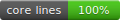

# TeX for Gmail (WebAssembly)

[](https://github.com/TomasOrtega/TeX-for-Gmail/actions/workflows/ci.yml)
[](https://github.com/TomasOrtega/TeX-for-Gmail/actions/workflows/ci.yml)
[](LICENSE)

A Firefox and Chrome extension that renders LaTeX inside Gmail drafts.
Compilation runs in the extension with pdfTeX and MuPDF WebAssembly builds; the
resulting PNG is inserted into the message, so recipients do not need the
extension.

This is a distinct WebAssembly-based fork, not the similarly named add-on
published by Valery Alexeev.

## Use

Open a Gmail draft, place the cursor in the message body, then either:

- click the extension button, enter LaTeX, and choose **Insert into Gmail**;
- select LaTeX in the draft and choose **Render LaTeX** from the context menu;
- select LaTeX and press <kbd>Alt</kbd>+<kbd>Shift</kbd>+<kbd>L</kbd>.

Inline delimiters (`$…$` and `\(...\)`) and display delimiters (`$$…$$` and
`\[…\]`) are recognized. Undelimited input is treated as inline math.

The first render can be slower while the packaged WebAssembly modules and TeX
Live runtime are initialized. Rendering is local: LaTeX source and email
content are not sent to a compilation service, and normal rendering does not
fetch runtime files from a CDN.

## Develop

Requirements: Node.js 22.8 or newer. Running the staged extension requires
Firefox 142 or newer for the Firefox target, or Chrome 116 or newer for the
Chrome target.

```sh
npm ci --ignore-scripts
npm test
npm run test:coverage
npm run lint
npm run start:firefox
```

`npm run validate` checks vendored dependencies, runs the coverage-gated test
suite, lints the Firefox target, builds both targets, verifies both ZIPs against
their staged source trees, and audits dependencies. After adding tests, run
`npm run coverage:update` to refresh the committed coverage badge.

Core coverage means every authored runtime JavaScript file under
`chrome-extension/src/` and `chrome-extension/popup/`. CI requires 100% line
coverage for that complete set. Vendored/generated resources and repository
maintenance scripts are outside the runtime badge and have separate integrity
and behavior checks.

The authored extension source is shared under `chrome-extension/`. Target
manifests live under `targets/firefox/` and `targets/chrome/`; generated staging
trees under `build/` should not be edited.

For a one-off Firefox install:

```sh
npm run stage:firefox
```

Open `about:debugging#/runtime/this-firefox`, choose **Load Temporary Add-on**,
and select `build/firefox/manifest.json`. Temporary add-ons are removed when
Firefox exits.

For a one-off Chrome install:

```sh
npm run stage:chrome
```

Open `chrome://extensions`, enable **Developer mode**, choose **Load unpacked**,
and select the `build/chrome` directory.

Build both target ZIPs with:

```sh
npm run build
```

Use `npm run build:firefox` or `npm run build:chrome` to build only one target.
The artifacts are written to
`dist/tex-for-gmail-firefox-<version>.zip` and
`dist/tex-for-gmail-chrome-<version>.zip`.

## Production and releases

Runtime artifacts and their provenance metadata are recorded in
[`artifacts.lock.json`](artifacts.lock.json); tests reject missing, changed, or
unexpected generated files. Release builds must come from a clean checkout,
pass `npm run validate`, and be inspected. Firefox and Chrome are separate
store submissions: Mozilla signs the Firefox package, while the Chrome package
is submitted independently to the Chrome Web Store. See the
[release process](docs/RELEASING.md), [Mozilla reviewer notes](docs/AMO_REVIEW.md),
and [Chrome Web Store reviewer notes](docs/CWS_REVIEW.md).

Release blockers remain. The historical `pdftex.bc` input, its derived pdfTeX
JavaScript/WebAssembly, and the prebuilt `pdflatex.fmt` predate complete,
reproducible source and build records; the corresponding-source and
package-specific license inventory is also incomplete. Checksums prevent
unnoticed changes but cannot reconstruct those inputs. Do not publish either
target until the source-review and third-party obligations in the
[release process](docs/RELEASING.md) and
[third-party notices](chrome-extension/THIRD_PARTY_NOTICES.md) have been
satisfied, or the affected artifacts have been replaced with reproducible
builds from documented source.

## Architecture and limitations

- The targets share the content script, popup, controller, renderer, workers,
  and packaged runtime. The build supplies the target manifest and excludes
  files that belong only to the other browser.
- Firefox uses a Manifest V2 non-persistent background page. Chrome uses a
  Manifest V3 service worker for browser actions and creates a packaged
  offscreen document when Gmail first requests the renderer; that document
  hosts the same worker-based renderer used by Firefox.
- The renderer creates one pdfTeX worker and one MuPDF worker lazily on first
  use. Both pools are terminated after five idle minutes or when the last
  connected Gmail tab goes away.
- The Gmail content script sends compilation requests over a runtime port and
  inserts a self-contained PNG data URL into the active editor.
- Only `https://mail.google.com/` is supported.

See [Contributing](CONTRIBUTING.md) for development expectations,
[Privacy](PRIVACY.md) for data handling, and [Security](SECURITY.md) for
vulnerability reporting.

Original project code is GPL-3.0-only. Bundled BrowserFS, pdfTeX, MuPDF, TeX
Live data, and Emscripten outputs retain their respective upstream terms; see
the [third-party notices](chrome-extension/THIRD_PARTY_NOTICES.md).
